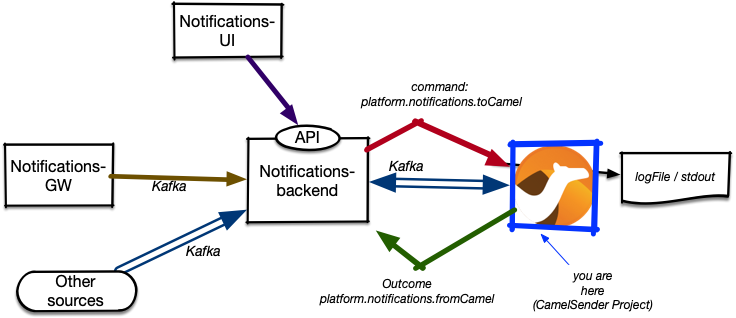

= Camel Sender Log

This subproject is a sample/reference implementation of a Camel sender.
It is meant for the development team to be able to round-trip the
delivery of an event via Camel.

== General Setup

Notifications has an integration type "camel" with subtypes.
Each subtype is for a different integration.

If a notification is meant for a Camel integration, the event is enriched with the integration properties and put on the `platform.notifications.tocamel` topic as a CloudEvent

The integration picks the message from Kafka, does its work and creates a new Event.
This event describes the outcome of the Components action, which it put on the
`platform.notifications.fromcamel` topic.

.NOTE
Each consumer (Camel Sender) type needs to listen on the same topic, but must be
in a different consumer group.
This needs to be done so that a consumer can inspect the message and check if it
should process it or not.

There is unfortunately no easy way in Kafka to tell consumers to only listen for messages on a topic that match a certain Kafka header key/value pair.

== About this component

The component itself only logs the input and then returns a success

=== Set up integration

You can use the `create_application_full.py` script in `../backend/helpers` for a setup.

Required properties are:

[source,python]
----
props = {
    "url": "http://does-not-matter",  #<1>
    "sub_type": "demo-log",           #<2>
    "extras": {
        "mode": "random",             #<3>
        "channel": "myLogger"         #<4>
    }
}
<1> The url is not needed in this component, but always required
<2> The subtype is the component name and required
<3> mode random makes the component randomly fail
<4> channel is the name of the logger to use

----
